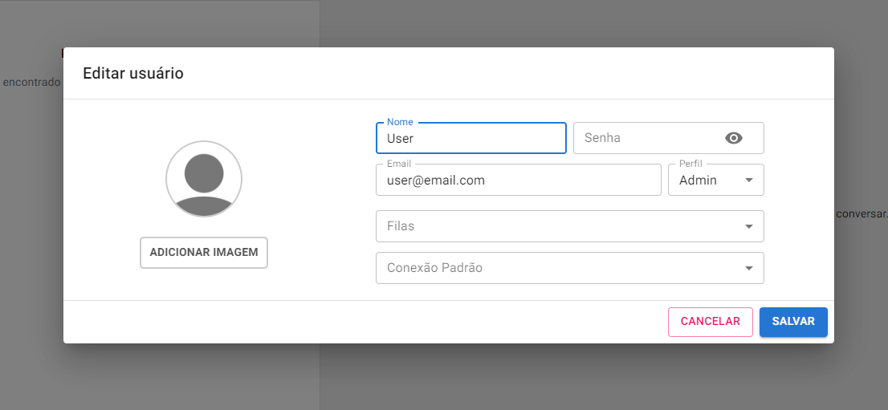
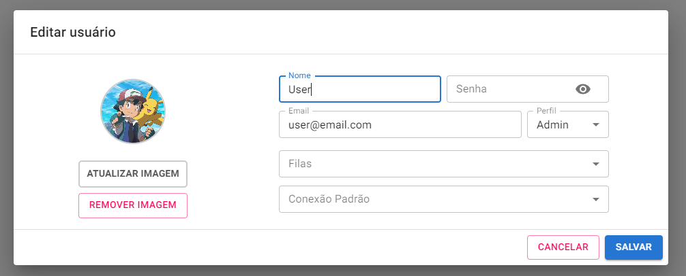
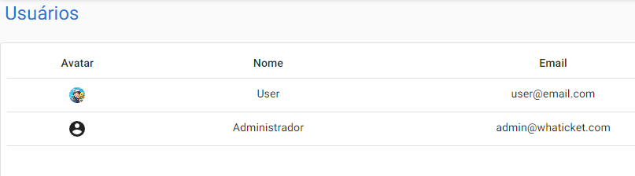

# WhaTicket - WhatsApp-based Ticket System

This project is a ticket management system designed to facilitate the handling and resolution of user inquiries and requests through WhatsApp. As part of this project, I had the opportunity to develop an innovative feature that enables the addition of profile pictures to users.

The system is built using the whatsapp-web.js library to interact with WhatsApp, allowing the receipt and sending of messages. It effectively transforms incoming WhatsApp messages into actionable tickets, which are then stored in a MySQL database for efficient management.

The frontend of the system is a fully-featured chat application, developed with react-create-app and Material UI. This frontend interacts with the backend through a combination of REST API calls and WebSockets. Users are empowered to engage with contacts, manage tickets, and effortlessly send and receive WhatsApp messages.

**Features:**

- Support for multiple users engaged in conversations with the same WhatsApp number ✅
- Capability to connect to multiple WhatsApp accounts, streamlining message reception ✅ 🆕
- Ability to establish conversations and exchange messages with new contacts directly from the system ✅
- Seamless sending and receipt of text messages ✅
- Effortless sharing and receipt of media files (images, audio, documents) ✅

**How It Works:**

- Upon receiving a new message from a WhatsApp-associated number, the system generates a new ticket.
- Tickets are presented in a queue on the "Tickets" page, where users can assign and accept tickets, respond to inquiries, and mark them as resolved.
- Subsequent messages from the same contact are automatically linked to the corresponding open or pending ticket.
- If a contact sends a new message within a 2-hour interval and there is no existing pending ticket, the most recent closed ticket will be reopened instead of creating a new one.

**Screenshots:**







## Installation and Usage (Linux Ubuntu - Development)

Create Mysql Database using docker:
_Note_: change MYSQL_DATABASE, MYSQL_PASSWORD, MYSQL_USER and MYSQL_ROOT_PASSWORD.

```bash
docker run --name whaticketdb -e MYSQL_ROOT_PASSWORD=strongpassword -e MYSQL_DATABASE=whaticket -e MYSQL_USER=whaticket -e MYSQL_PASSWORD=whaticket --restart always -p 3306:3306 -d mariadb:latest --character-set-server=utf8mb4 --collation-server=utf8mb4_bin

# Or run using `docker-compose` as below
# Before copy .env.example to .env first and set the variables in the file.
docker-compose up -d mysql

# To administer this mysql database easily using phpmyadmin. 
# It will run by default on port 9000, but can be changed in .env using `PMA_PORT`
docker-compose -f docker-compose.phpmyadmin.yaml up -d
```

Install puppeteer dependencies:

```bash
sudo apt-get install -y libxshmfence-dev libgbm-dev wget unzip fontconfig locales gconf-service libasound2 libatk1.0-0 libc6 libcairo2 libcups2 libdbus-1-3 libexpat1 libfontconfig1 libgcc1 libgconf-2-4 libgdk-pixbuf2.0-0 libglib2.0-0 libgtk-3-0 libnspr4 libpango-1.0-0 libpangocairo-1.0-0 libstdc++6 libx11-6 libx11-xcb1 libxcb1 libxcomposite1 libxcursor1 libxdamage1 libxext6 libxfixes3 libxi6 libxrandr2 libxrender1 libxss1 libxtst6 ca-certificates fonts-liberation libappindicator1 libnss3 lsb-release xdg-utils
```

Clone this repo

```bash
git clone https://github.com/AntonioWingert/whaticket whaticket
```

Go to backend folder and create .env file:

```bash
cp .env.example .env
nano .env
```

Fill `.env` file with environment variables:

```bash
NODE_ENV=DEVELOPMENT      #it helps on debugging
BACKEND_URL=http://localhost
FRONTEND_URL=https://localhost:3000
PROXY_PORT=8080
PORT=8080

DB_HOST=                  #DB host IP, usually localhost
DB_DIALECT=
DB_USER=
DB_PASS=
DB_NAME=

JWT_SECRET=3123123213123
JWT_REFRESH_SECRET=75756756756
```

Install backend dependencies, build app, run migrations and seeds:

```bash
npm install
npm run build
npx sequelize db:migrate
npx sequelize db:seed:all
```

Start backend:

```bash
npm start
```

Open a second terminal, go to frontend folder and create .env file:

```bash
nano .env
REACT_APP_BACKEND_URL = http://localhost:8080/ # Your previous configured backend app URL.
```

Start frontend app:

This project requires Node.js version 16 or lower. Starting from Node.js version 17, compatibility issues may arise. Make sure to use an appropriate version when setting up the environment to run this project.


```bash
npm install
npm start
```

- Go to http://your_server_ip:3000/signup
- Create an user and login with it.
- On the sidebard, go to _Connections_ page and create your first WhatsApp connection.
- Wait for QR CODE button to appear, click it and read qr code.
- Every message received by your synced WhatsApp number will appear in Tickets List.
- Done! If you have any questions, feedback, or suggestions regarding the modifications I've made, please don't hesitate to get in touch! You can reach me via email at antoniobwingert@gmail.com or check out my GitHub profile at [AntonioWingert](https://github.com/AntonioWingert).

## Basic production deployment

### Using Ubuntu 20.04 VPS

All instructions below assumes you are NOT running as root, since it will give an error in puppeteer. So let's start creating a new user and granting sudo privileges to it:

```bash
adduser deploy
usermod -aG sudo deploy
```

Now we can login with this new user:

```bash
su deploy
```

You'll need two subdomains forwarding to yours VPS ip to follow these instructions. We'll use `myapp.mydomain.com` to frontend and `api.mydomain.com` to backend in the following example.

Update all system packages:

```bash
sudo apt update && sudo apt upgrade
```

Install node, and confirm node command is available:

```bash
curl -fsSL https://deb.nodesource.com/setup_14.x | sudo -E bash -
sudo apt-get install -y nodejs
node -v
npm -v
```

Install docker and add you user to docker group:

```bash
sudo apt install apt-transport-https ca-certificates curl software-properties-common
curl -fsSL https://download.docker.com/linux/ubuntu/gpg | sudo apt-key add -
sudo add-apt-repository "deb [arch=amd64] https://download.docker.com/linux/ubuntu bionic stable"
sudo apt update
sudo apt install docker-ce
sudo systemctl status docker
sudo usermod -aG docker ${USER}
su - ${USER}
```

Create Mysql Database using docker:
_Note_: change MYSQL_DATABASE, MYSQL_PASSWORD, MYSQL_USER and MYSQL_ROOT_PASSWORD.

```bash
docker run --name whaticketdb -e MYSQL_ROOT_PASSWORD=strongpassword -e MYSQL_DATABASE=whaticket -e MYSQL_USER=whaticket -e MYSQL_PASSWORD=whaticket --restart always -p 3306:3306 -d mariadb:latest --character-set-server=utf8mb4 --collation-server=utf8mb4_bin

# Or run using `docker-compose` as below
# Before copy .env.example to .env first and set the variables in the file.
docker-compose up -d mysql

# To administer this mysql database easily using phpmyadmin. 
# It will run by default on port 9000, but can be changed in .env using `PMA_PORT`
docker-compose -f docker-compose.phpmyadmin.yaml up -d
```

Clone this repository:

```bash
cd ~
git clone https://github.com/canove/whaticket whaticket
```

Create backend .env file and fill with details:

```bash
cp whaticket/backend/.env.example whaticket/backend/.env
nano whaticket/backend/.env
```

```bash
NODE_ENV=
BACKEND_URL=https://api.mydomain.com      #USE HTTPS HERE, WE WILL ADD SSL LATTER
FRONTEND_URL=https://myapp.mydomain.com   #USE HTTPS HERE, WE WILL ADD SSL LATTER, CORS RELATED!
PROXY_PORT=443                            #USE NGINX REVERSE PROXY PORT HERE, WE WILL CONFIGURE IT LATTER
PORT=8080

DB_HOST=localhost
DB_DIALECT=
DB_USER=
DB_PASS=
DB_NAME=

JWT_SECRET=3123123213123
JWT_REFRESH_SECRET=75756756756
```

Install puppeteer dependencies:

```bash
sudo apt-get install -y libxshmfence-dev libgbm-dev wget unzip fontconfig locales gconf-service libasound2 libatk1.0-0 libc6 libcairo2 libcups2 libdbus-1-3 libexpat1 libfontconfig1 libgcc1 libgconf-2-4 libgdk-pixbuf2.0-0 libglib2.0-0 libgtk-3-0 libnspr4 libpango-1.0-0 libpangocairo-1.0-0 libstdc++6 libx11-6 libx11-xcb1 libxcb1 libxcomposite1 libxcursor1 libxdamage1 libxext6 libxfixes3 libxi6 libxrandr2 libxrender1 libxss1 libxtst6 ca-certificates fonts-liberation libappindicator1 libnss3 lsb-release xdg-utils
```

Install backend dependencies, build app, run migrations and seeds:

```bash
cd whaticket/backend
npm install
npm run build
npx sequelize db:migrate
npx sequelize db:seed:all
```

Start it with `npm start`, you should see: `Server started on port...` on console. Hit `CTRL + C` to exit.

Install pm2 **with sudo**, and start backend with it:

```bash
sudo npm install -g pm2
pm2 start dist/server.js --name whaticket-backend
```

Make pm2 auto start after reboot:

```bash
pm2 startup ubuntu -u `YOUR_USERNAME`
```

Copy the last line outputed from previus command and run it, its something like:

```bash
sudo env PATH=\$PATH:/usr/bin pm2 startup ubuntu -u YOUR_USERNAME --hp /home/YOUR_USERNAM
```

Go to frontend folder and install dependencies:

```bash
cd ../frontend
npm install
```

Create frontend .env file and fill it ONLY with your backend address, it should look like this:

```bash
REACT_APP_BACKEND_URL = https://api.mydomain.com/
```

Build frontend app:

```bash
npm run build
```

Start frontend with pm2, and save pm2 process list to start automatically after reboot:

```bash
pm2 start server.js --name whaticket-frontend
pm2 save
```

To check if it's running, run `pm2 list`, it should look like:

```bash
deploy@ubuntu-whats:~$ pm2 list
┌─────┬─────────────────────────┬─────────────┬─────────┬─────────┬──────────┬────────┬──────┬───────────┬──────────┬──────────┬──────────┬──────────┐
│ id  │ name                    │ namespace   │ version │ mode    │ pid      │ uptime │ .    │ status    │ cpu      │ mem      │ user     │ watching │
├─────┼─────────────────────────┼─────────────┼─────────┼─────────┼──────────┼────────┼──────┼───────────┼──────────┼──────────┼──────────┼──────────┤
│ 1   │ whaticket-frontend      │ default     │ 0.1.0   │ fork    │ 179249   │ 12D    │ 0    │ online    │ 0.3%     │ 50.2mb   │ deploy   │ disabled │
│ 6   │ whaticket-backend       │ default     │ 1.0.0   │ fork    │ 179253   │ 12D    │ 15   │ online    │ 0.3%     │ 118.5mb  │ deploy   │ disabled │
└─────┴─────────────────────────┴─────────────┴─────────┴─────────┴──────────┴────────┴──────┴───────────┴──────────┴──────────┴──────────┴──────────┘

```

Install nginx:

```bash
sudo apt install nginx
```

Remove nginx default site:

```bash
sudo rm /etc/nginx/sites-enabled/default
```

Create a new nginx site to frontend app:

```bash
sudo nano /etc/nginx/sites-available/whaticket-frontend
```

Edit and fill it with this information, changing `server_name` to yours equivalent to `myapp.mydomain.com`:

```bash
server {
  server_name myapp.mydomain.com;

  location / {
    proxy_pass http://127.0.0.1:3333;
    proxy_http_version 1.1;
    proxy_set_header Upgrade $http_upgrade;
    proxy_set_header Connection 'upgrade';
    proxy_set_header Host $host;
    proxy_set_header X-Real-IP $remote_addr;
    proxy_set_header X-Forwarded-Proto $scheme;
    proxy_set_header X-Forwarded-For $proxy_add_x_forwarded_for;
    proxy_cache_bypass $http_upgrade;
  }
}
```

Create another one to backend api, changing `server_name` to yours equivalent to `api.mydomain.com`, and `proxy_pass` to your localhost backend node server URL:

```bash
sudo cp /etc/nginx/sites-available/whaticket-frontend /etc/nginx/sites-available/whaticket-backend
sudo nano /etc/nginx/sites-available/whaticket-backend
```

```bash
server {
  server_name api.mydomain.com;

  location / {
    proxy_pass http://127.0.0.1:8080;
    ......
}
```

Create a symbolic links to enable nginx sites:

```bash
sudo ln -s /etc/nginx/sites-available/whaticket-frontend /etc/nginx/sites-enabled
sudo ln -s /etc/nginx/sites-available/whaticket-backend /etc/nginx/sites-enabled
```

By default, nginx limit body size to 1MB, which isn't enough for some media uploads. Lets change it to 20MB, adding a new line to config file:

```bash
sudo nano /etc/nginx/nginx.conf
...
http {
    ...
    client_max_body_size 20M; # HANDLE BIGGER UPLOADS
}
```

Test nginx configuration and restart server:

```bash
sudo nginx -t
sudo service nginx restart
```

Now, enable SSL (https) on your sites to use all app features like notifications and sending audio messages. An easy way to this is using Certbot:

Install certbot:

```bash
sudo snap install --classic certbot
sudo apt update
```

Enable SSL on nginx (Fill / Accept all information required):

```bash
sudo certbot --nginx
```

### Using docker and docker-compose

To run WhaTicket using docker you must perform the following steps:

```bash
cp .env.example .env
```

Now it will be necessary to configure the .env using its information, the variables are the same as those mentioned in the deployment using ubuntu, with the exception of mysql settings that were not in the .env. 

```bash
# MYSQL
MYSQL_ENGINE=                           # default: mariadb
MYSQL_VERSION=                          # default: 10.6
MYSQL_ROOT_PASSWORD=strongpassword      # change it please
MYSQL_DATABASE=whaticket
MYSQL_PORT=3306                         # default: 3306; Use this port to expose mysql server
TZ=America/Fortaleza                    # default: America/Fortaleza; Timezone for mysql

# BACKEND
BACKEND_PORT=                           # default: 8080; but access by host not use this port
BACKEND_SERVER_NAME=api.mydomain.com
BACKEND_URL=https://api.mydomain.com
PROXY_PORT=443
JWT_SECRET=3123123213123                # change it please
JWT_REFRESH_SECRET=75756756756          # change it please

# FRONTEND
FRONTEND_PORT=80                        # default: 3000; Use port 80 to expose in production
FRONTEND_SSL_PORT=443                   # default: 3001; Use port 443 to expose in production
FRONTEND_SERVER_NAME=myapp.mydomain.com
FRONTEND_URL=https://myapp.mydomain.com

# BROWSERLESS
MAX_CONCURRENT_SESSIONS=                # default: 1; Use only if using browserless
```

After defining the variables, run the following command:

```bash
docker-compose up -d --build
```

On the `first` run it will be necessary to seed the database tables using the following command:

```bash
docker-compose exec backend npx sequelize db:seed:all
```

#### SSL Certificate

To deploy the ssl certificate, add it to the `ssl/certs` folder. Inside it there should be a `backend` and a `frontend` folder, and each of them should contain the files `fullchain.pem` and `privkey.pem`, as in the structure below:

```bash
.
├── certs
│   ├── backend
│   │   ├── fullchain.pem
│   │   └── privkey.pem
│   └── frontend
│       ├── fullchain.pem
│       └── privkey.pem
└── www
```

To generate the certificate files use `certbot` which can be installed using snap, I used the following command:

Note: The frontend container that runs nginx is already prepared to receive the request made by certboot to validate the certificate.

```bash
# BACKEND
certbot certonly --cert-name backend --webroot --webroot-path ./ssl/www/ -d api.mydomain.com

# FRONTEND
certbot certonly --cert-name frontend --webroot --webroot-path ./ssl/www/ -d myapp.mydomain.com
```

## Access Data

User: admin@whaticket.com
Password: admin

## Upgrading

WhaTicket is a working in progress and we are adding new features frequently. To update your old installation and get all the new features, you can use a bash script like this:

**Note**: Always check the .env.example and adjust your .env file before upgrading, since some new variable may be added.

```bash
nano updateWhaticket
```

```bash
#!/bin/bash
echo "Updating Whaticket, please wait."

cd ~
cd whaticket
git pull
cd backend
npm install
rm -rf dist
npm run build
npx sequelize db:migrate
npx sequelize db:seed
cd ../frontend
npm install
rm -rf build
npm run build
pm2 restart all

echo "Update finished. Enjoy!"
```

Make it executable and run it:

```bash
chmod +x updateWhaticket
./updateWhaticket
```

## Contribution

This project is open-source, and you're welcome to contribute by suggesting improvements, bug fixes, and new features. Feel free to open pull requests or discuss ideas in the GitHub repository's issue section: [https://github.com/canove/whaticket](https://github.com/canove/whaticket)

Always remember to follow recommended security practices when setting up communication systems with external APIs like WhatsApp to avoid potential blocks or other restrictions.
